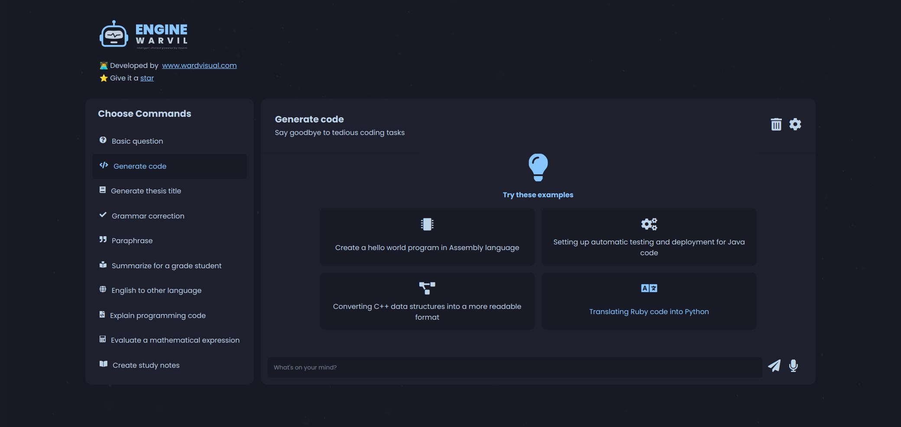

<div id="top"></div>

<!-- PROJECT LOGO -->
<br />
<div align="center">
  <a href="https://github.com/wardvisual/engine-warvil">
    
  </a>
  <br />
  <h2 align="center">Engine Warvil</h2>

  <p align="start">Engine-warvil is a comprehensive language tool that is designed to answer basic questions, generate code, titles, and grammatically correct text. The engine also includes features for paraphrasing text, summarizing, translating to other languages, explaining programming code, evaluating mathematical expressions, and creating study notes. 
  
  With its versatile and diverse functionality, Engine-warvil is an ideal tool for students, developers, researchers, and anyone in need of language-related assistance. Whether you're looking to quickly translate text, generate code or improve your writing, Engine-warvil has you covered.
</p>
    <br />
    <a href="https://engine-warvil.vercel.app/"><strong>View Project »</strong></a>
    <br />    
    <br />
    <a href="https://github.com/wardvisual/engine-warvil">View Demo</a>
    ·
    <a href="https://github.com/wardvisual/engine-warvil/issues">Report Bug</a>
    ·
    <a href="https://github.com/wardvisual/engine-warvil/issues">Request Feature</a>
  
</div>

<br />
<a href="https://github.com/wardvisual/engine-warvil">
   
</a>

<br />
<!-- BUILT WITH -->

<hr />

### Built With

- [Next.js](https://nextjs.org/)
- [Typescript](https://www.typescriptlang.org/)
- [OpenAI](https://openai.com/)

### Prerequisites

- Docker installed on your machine
- Node.js and npm installed on your machine
- A code editor of your choice
- Familiarity with terminal or command prompt

<!-- INSTALLATION -->

### Installation

1. Clone the repo

   ```sh
   git clone https://github.com/wardvisual/engine-warvil.git
   ```

### Setup

1. Navigate to the Directory

   ```sh
   cd engine_warvil
   ```

2. Create a copy of `.env.example` file

   ```sh
   cp .env.example .env
   ```

3. Enter your OpenAI API Key in `.env` file

   ```sh
   OPENAI_API_KEY = 'ENTER YOUR OpenAI API KEY'
   ```

4. Make the `docker-entrypoint.sh` script executable

   ```sh
   chmod +x docker-entrypoint.sh
   ```

5. Build the Docker Image

   ```sh
   docker compose up --build --force-recreate
   ```

6. Access the Application

   You can now access the Engine Warvil application by visiting `http://localhost:3000` in your web browser.

<hr />

<!-- FEATURES -->

### Key Features

Some of these features may not respond correctly while they are being developed.

<details>
  <summary>Answer Basic Questions </summary>
    Warvil is able to answer basic questions about a variety of topics using artificial intelligence.
</details>
<details>
  <summary>Generate Code </summary>
    Warvil can generate code for a variety of programming languages based on your specifications.
</details>
<details>
  <summary>Generate Thesis Titles </summary>
    Warvil can generate potential titles for your thesis or research project.
</details>
<details>
  <summary>Correct Grammar </summary>
    Warvil can help you improve your writing by correcting grammar errors and providing suggestions for improvement.
</details>
<details>
  <summary>Paraphrase Text </summary>
    Warvil can rewrite text to convey the same information in a different way, making it easier to understand.
</details>
<details>
  <summary>Summarize </summary>
    Warvil can generate a summary of longer pieces of text, helping you save time and focus on the most important information.
</details>
<details>
  <summary>Translate to Other Languages </summary>
    Warvil can translate text from English to a variety of other languages.
</details>
<details>
  <summary>Explain Programming Code </summary>
    Warvil can provide explanations and examples for programming concepts and code snippets.
</details>
<details>
  <summary>Evaluate Mathematical Expressions </summary>
    Warvil can evaluate and simplify mathematical expressions.
</details>
 
<details>
  <summary>Create Study Notes </summary>
    Warvil can generate study notes based on text input, helping you learn and retain information more effectively.
</details>

<hr />

<!-- LICENSE -->

## License

Distributed under the MIT License. See `LICENSE` for more information.

<!-- CONTACT -->

## Contact

Edward Fernandez: [Wardvisual](https://wardvisual.me/)

Project Link: [Engine Warvil](https://engine-warvil.vercel.app/)
