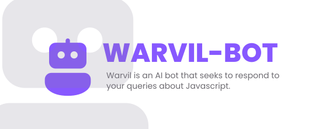

<div id="top"></div>

<!-- [![Contributors][contributors-shield]][contributors-url]
[![Forks][forks-shield]][forks-url]
[![Stargazers][stars-shield]][stars-url]
[![Issues][issues-shield]][issues-url]
[![MIT License][license-shield]][license-url]
[![LinkedIn][linkedin-shield]][linkedin-url] -->

<!-- PROJECT LOGO -->
<br />
<div align="center">
  <a href="https://github.com/wardvisual/warvil-bot">
    
  </a>

  <h3 align="center">Warvil Bot</h3>

  <p align="center">WWarvil is an AI bot that seeks to respond to your queries about programming. It is programmed to provide you with information about various programming concepts, tools, and languages. Additionally, Warvil can answer questions about the development process and the different stages of creating a program. </p>
    <br />
    <br />
    <a href="https://github.com/wardvisual/warvil-bot"><strong>View Project »</strong></a>
    <br />    
    <br />
    <a href="https://github.com/wardvisual/warvil-bot">View Demo</a>
    ·
    <a href="https://github.com/wardvisual/warvil-bot/issues">Report Bug</a>
    ·
    <a href="https://github.com/wardvisual/warvil-bot/issues">Request Feature</a>
  
</div>

### Built With

- [Next.js](https://nextjs.org/)
- [Typescript](https://www.typescriptlang.org/)
- [OpenAI](https://openai.com/)

<!-- INSTALLATION -->

### Installation

1. Clone the repo

   ```sh
   git clone https://github.com/wardvisual/warvil-bot.git
   ```

2. Install NPM packages

   ```sh
   cd warvil-bot && npm install
   ```

<!-- CONTACT -->

## Contact

Edward Fernandez - [@wardvisual](https://twitter.com/wardvisual)

Project Link: [warvil-bot](https://warvil.vercel.app)
