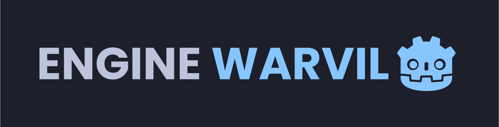

<div id="top"></div>

<!-- [![Contributors][contributors-shield]][contributors-url]
[![Forks][forks-shield]][forks-url]
[![Stargazers][stars-shield]][stars-url]
[![Issues][issues-shield]][issues-url]
[![MIT License][license-shield]][license-url]
[![LinkedIn][linkedin-shield]][linkedin-url] -->

<!-- PROJECT LOGO -->
<br />
<div align="center">
  <a href="https://github.com/wardvisual/engine-warvil">
    
  </a>

  <h3 align="center">Engine Warvil</h3>

  <p align=" center">Warvil is an intelligent chatbot powered by artificial intelligence. It is designed to provide helpful and insightful answers to your questions. Warvil can learn from its conversations with you, allowing it to become increasingly efficient and knowledgeable over time.</p>
  <p>THIS PROJECT IS UNDER DEVELOPMENT</p>
    <br />
    <br />
    <a href="https://engine-warvil.vercel.app/"><strong>View Project »</strong></a>
    <br />    
    <br />
    <a href="https://github.com/wardvisual/engine-warvil">View Demo</a>
    ·
    <a href="https://github.com/wardvisual/engine-warvil/issues">Report Bug</a>
    ·
    <a href="https://github.com/wardvisual/engine-warvil/issues">Request Feature</a>
  
</div>

### Built With

- [Next.js](https://nextjs.org/)
- [Typescript](https://www.typescriptlang.org/)
- [OpenAI](https://openai.com/)

<!-- INSTALLATION -->

### Installation

1. Clone the repo

   ```sh
   git clone https://github.com/wardvisual/engine-warvil.git
   ```

2. Install NPM packages

   ```sh
   cd warvil-bot && npm install
   ```

<!-- CONTACT -->

## Contact

Edward Fernandez - [@wardvisual](https://twitter.com/wardvisual)

Project Link: [warvil-bot](https://engine-warvil.vercel.app/)
